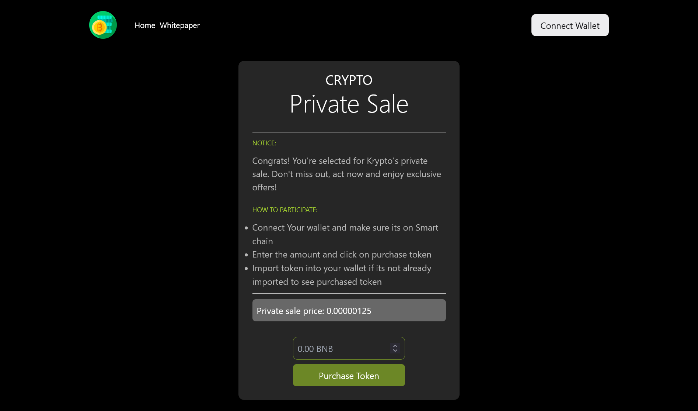

# Crypto Private Sale Website - Portfolio Project

Welcome to the README file for the crypto Private sale Website, a portfolio project developed using Next.js, ThirdWeb, and Vyper for smart contracts. This project aims to showcase a web application that facilitates private sales of cryptocurrencies through smart contracts on the EVM based blokchain. Below you'll find essential information about the project's setup, features, and how to run it.

## Table of Contents

- [Introduction](#introduction)
- [Features](#features)
- [Technologies Used](#technologies-used)
- [Getting Started](#getting-started)
  - [Prerequisites](#prerequisites)
  - [Installation](#installation)
  - [Running the Application](#running-the-application)
- [Smart Contract](#smart-contract)
- [License](#license)

## Introduction

The platform is built using Next.js for the frontend, ThirdWeb Library, and Vyper for writing the smart contracts. It provides a user-friendly interface for investors to purchase tokens, and interact with the smart contracts securely.

## Features

- **Token Purchase**: Users can participate in private sales by purchasing tokens using BNB.
- **Smart Contracts**: Utilizes Vyper for writing and deploying Ethereum smart contracts.
- **Responsive Design**: Responsive and mobile-friendly user interface.

## Technologies Used

- **Next.js**: A React framework for building server-rendered React applications.
- **ThirdWeb**: A library for interacting with Ethereum smart contracts in React applications.
- **Vyper**: A smart contract programming language for Ethereum.
- **Ethereum**: The blockchain network for executing smart contracts and transactions.
- **Web3.js**: Ethereum JavaScript API for interacting with Ethereum nodes.
- **Semantic UI**: CSS framework for styling the user interface.

## Getting Started

Follow the steps below to get the Crypto Private Sale Website up and running on your local machine.

### Prerequisites

- Node.js and npm: Make sure you have Node.js (v14 or higher) and npm installed.
- Ethereum Wallet: You'll need an Ethereum wallet to deploy and interact with smart contracts.

### Installation

1. Clone the repository: `https://github.com/kenfelix/crypto_private_sale_website.git`
2. Navigate to the project directory: `cd crypto_private_sale_website`
3. Install dependencies: `npm install`

### Running the Application

1. Start the development server: `npm run dev`
2. Open your browser and navigate to `http://localhost:3000` to access the application.

## Smart Contract

The smart contract code is written in Vyper and its contract address and ABI is available in the `app/contract.ts`. The Smart Contract was deployed to the BSC testnet.

## License

This project is licensed under the [MIT License](LICENSE).

---

For any questions or support, contact [emekaokafor08056@gmail.com](mailto:emekaokafor08056@gmail.com).
